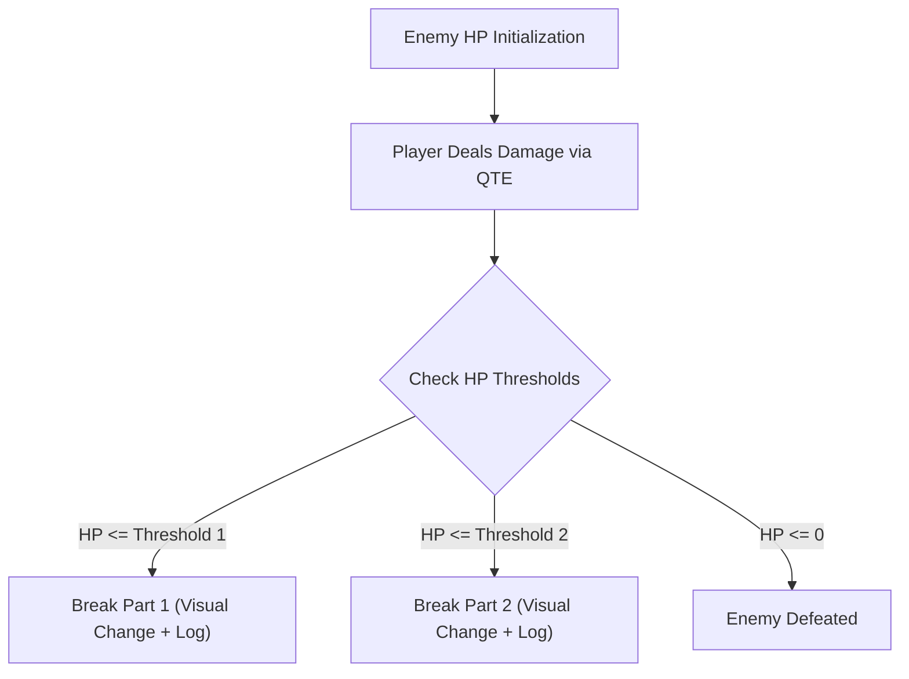

# Norilsk Combat System Design Document

**Document Version:** 1.2.0  
**Source Feature Notes:** `norilsk fight .md`  
**Target Engine:** Ren'Py 8.3+ (Python 3.11+)  
**Architecture:** Model-View-Controller (Spring-style OOP Separation for Ren'Py)  
**Related Specs:** `norilsk_scavenge_design_doc.md`

---

## 1. Executive Summary & Design Philosophy

The **Norilsk Combat System** is an active, turn-based Quick-Time Event (QTE) mini-game designed to keep visual novel combat engaging, visceral, and fast-paced without overly complex RPG menus.

### Core Pillars
1. **TV Overlay QTE Mechanics:** When entering combat, clicking "Fight" triggers an in-game retro TV screen overlay. Dynamic target button patterns pop up in rapid sequence while a weapon-dependent countdown timer ticks down.
2. **Dynamic Weapon Typings:** Three primary weapon classes—**Slashing**, **Blunt**, and **Regular**—each with distinct button layout geometry, risk/reward formulas, and status effects.
3. **No Enemy HP Bars (Visual Part Destruction):** Enemies do *not* display health bars. Instead, player damage breaks off visual body parts at predefined HP thresholds, providing organic, high-stakes visual feedback.
4. **Integrated Resource Management:** Combat connects directly to the scavenging system (see [norilsk_scavenge_design_doc.md](file:///h:/renpy%20projects/norilsk2/game/feature_documents/norilsk_scavenge_design_doc.md)). Players can use food items in combat to heal HP.

---

## 2. Combat Flow & Interface Design

### 2.1 Main Combat Arena UI (`combat_main_screen`)
- **Background Frame:** Scene background showing the encounter location and enemy sprite.
- **Player HUD:**
  - Health Bar: Starts at 100 HP max.
  - Equipped Weapon Badge: Displays current weapon name and icon.
  - Action Panel:
    - **[ Fight ] Button:** Launches the TV QTE attack phase.
    - **[ Heal (Food xN) ] Button:** Consumes 1 food item to restore 25 HP.
- **On-Screen Combat Log:** A scrollable text box displaying combat history (hits, damage dealt, enemy part destructions, counter-attacks, stuns, and healing).
- **Debug Panel:** Toggleable overlay providing shortcuts for rapid testing and QA.

### 2.2 TV QTE Overlay (`combat_tv_qte_overlay`)
- Centered retro TV bezel overlaying the main arena.
- **Real-Time Countdown Timer:** Displays remaining time (e.g. 14.0s -> 0.0s).
- **Target Button Popups:** Buttons appear in layout phases. Players click targets before timer expiration.
- **Phase Transitions:** After a set time (e.g. 5 seconds), layout phase 1 vanishes and phase 2 appears.

---

## 3. Weapon Typings & Mechanics

| Weapon Class | Layout Geometry | Damage Calculation Rule | Special Status Effect |
| :--- | :--- | :--- | :--- |
| **Slashing (Sharp)** | Archs, slashes, or straight diagonal lines | **All-or-Nothing:** High base damage if 100% of buttons are hit. **0 damage** if even 1 button is missed. | None |
| **Blunt** | Cluster groups in multiples of 2 (2, 4, 6, 8 buttons) | **Proportional Damage:** Base damage scales with % of buttons hit. | **Stun Chance:** 100% hit rate grants a chance to stun non-boss enemies for 1 turn. |
| **Regular** | Randomly scattered across screen grid | **Proportional Damage:** Base damage scales linearly with % of buttons hit. | None |

---

## 4. Weapon Database

| Weapon Name | Typing | Base Damage | Timer (s) | Layout Phases | Button Config & Special Rules |
| :--- | :--- | :--- | :--- | :--- | :--- |
| **Knife** | Slashing | 20 (Flat) | 10s | 2 phases (5s switch) | Phase 1: 3 slash groupings. Phase 2: 2 slash groupings. Must hit 100% for damage. |
| **Hammer** | Blunt | 12 – 18 | 14s | 2 phases (6s switch) | Phase 1: 2 pairs (4 buttons). Phase 2: 2 pairs (4 buttons). 100% hit = Stun chance. |
| **Stick** | Regular | 10 – 15 | 15s | 1 phase | High density random scatter buttons. |
| **Sledge Hammer** | Blunt | 10 – 24 | 12s | 2 phases (6s each) | Heavier blunt weapon; higher damage ceiling + Stun chance. |
| **Taser** | Blunt | 8 – 14 | 8s | 2 phases | Lightning bolt pattern. **100% Stun:** Always stuns enemy on 100% hit rate. |
| **Chainsaw** | Slashing | 50 | 10s | 2 phases (5s each) | Massive line of buttons. Extreme damage output on 100% hit completion. |
| **Katana** | Slashing | 30 (Flat) | 15s | 3 phases (5s each) | Precision sharp weapon with 3 phase transitions. |
| **Axe** | Slashing | 35 | 12s | 1 phase | Severing weapon. Grants temporary damage boost upon breaking an enemy body part. |
| **Gun** | Regular | 10 – 25 | 10s | 1 phase | Rapid dual-side button pairs (far-left and far-right alternating buttons). |
| **Ice Pick** | Regular | 15 – 24 | 8s | 1 phase | Fast-paced short burst layout. |
| **Dah Dog (Pet)** | Companion | 4 – 8 (Passive) | N/A | Passive per turn | When acquired, dog automatically bites active enemy every turn for 4–8 extra damage. |

---

## 5. Enemy Roster & Body Part Breakdown

Enemies do not feature health bars. Damage progress is tracked by destroying body parts at health thresholds.



### 5.1 Regular Monsters & Minions

#### 1. Small Tendril
- **Total HP:** 50
- **Attack Damage:** 5 – 10
- **Body Parts (2):**
  - Top Part: Breaks at **25 HP remaining** (50% HP lost).
  - Main Core: Destroyed at **0 HP** (Death).

#### 2. Medium Tendril
- **Total HP:** 90
- **Attack Damage:** 10 – 20
- **Body Parts (3):**
  - Top Part: Breaks at **60 HP remaining**.
  - Middle Part: Breaks at **30 HP remaining**.
  - Base: Destroyed at **0 HP** (Death).

#### 3. Parasitic Tendril
- **Total HP:** 120
- **Attack Damage:** 10 – 15 + Poison
- **Body Parts (3):**
  - Part 1: Breaks at **60 HP remaining**.
  - Part 2: Breaks at **30 HP remaining**.
  - Core: Destroyed at **0 HP**.
- **Special Trap Mechanism:** Generates **Fake/Red Herring Buttons** on the TV screen overlay. Clicking a fake button immediately inflicts 5–10 damage to the player!

### 5.2 Boss Encounters

#### 1. Behemoth (Boss 1)
- **Total HP:** 200
- **Spawns With:** 2 Small Tendrils.
- **Body Parts (4):** 1 part breaks every **50 HP lost** (150 HP, 100 HP, 50 HP, 0 HP).
- **Special Wind-Up Attack:** Takes 3 to 4 turns winding up. Inflicts **40 massive damage** upon completion. Has no standard attack. Immune to standard stuns.

#### 2. Leviathan (Boss 2)
- **Total HP:** 200
- **Attack Damage:** 10 – 30
- **Spawns With:** 2 Small Tendrils.
- **Body Parts (4):** 1 part breaks every **50 HP lost**.
- **Special Hold Attack:** Holds the player, causing them to miss their turn (2 turn cooldown). **Mechanic:** This hold ability is disabled once the 2 spawned Small Tendrils are killed!

#### 3. Final Boss (Boss 3)
- **Total HP:** 210
- **Attack Damage:** 40
- **Spawns With:** 2 Parasitic Tendrils.
- **Body Parts (5):** 1 part breaks every **42 HP lost**.
- **Combined Threat:** Features 3-turn cooldown player hold + 4-turn wind-up 40 damage attack + Parasite fake button distraction overlay.

---

## 6. Scavenging System Integration
*(Note: Complete Scavenging System specification has been modularized into [norilsk_scavenge_design_doc.md](file:///h:/renpy%20projects/norilsk2/game/feature_documents/norilsk_scavenge_design_doc.md)).*

---

## 7. Entry Point Routing & Prototype Architecture

### 7.1 Entry Point & Dev Router (`game/scripts/script.rpy`)
- `label start`:
  - Checks `if config.developer:`.
  - In dev mode: Displays choice menu:
    - `"Start Main Story (Day 1)"` -> `jump d1start`
    - `"Test Combat Prototype (Hammer vs Small Tendril)"` -> `jump combat_test_scene`
  - In release mode: Automatically `jump d1start`.

### 7.2 Main Story Entry (`game/scripts/scenes/day1/d1start.rpy`)
- `label d1start`: Houses original intro scene sequence previously in `start.rpy`.

### 7.3 Data Models (`game/scripts/models/combat_models.rpy`)
- `WeaponType` (Enum: `SLASHING`, `BLUNT`, `REGULAR`)
- `WeaponData`: Holds weapon configuration.
- `BodyPart`: Tracks individual part break threshold and status.
- `EnemyData`: Holds enemy name, HP, body parts, attack range, stunned state.
- `PlayerCombatState`: Player HP (max 100), food count, current weapon.
- `CombatLog`: Maintains chronological battle event list.
- `QTEButtonTarget`: Relative X/Y coords, target type, clicked state.

### 7.4 Logic Service (`game/scripts/services/combat_service.rpy`)
- `CombatService`:
  - `start_combat(player, enemy, weapon)`
  - `start_qte_phase()`
  - `click_qte_target(target_id)`
  - `evaluate_qte_result()`: Computes damage based on weapon typing.
  - `evaluate_enemy_body_parts()`: Triggers part breaks and logs event messages.
  - `enemy_attack_turn()`: Calculates enemy attack or processes stun skip.
  - `heal_player()`: Consumes food item, adds +25 HP to player.
  - `debug_` helpers (Instant Win, Instant Kill, Stun Toggle, Auto-QTE).

### 7.5 Visual Presentation (`game/scripts/screens/combat_screens.rpy`)
- `screen combat_main`: Arena HUD, player HP, food count, action panel (Fight / Heal), combat log box, debug panel.
- `screen combat_tv_qte_overlay`: Retro TV frame, live timer countdown bar, dynamic target button grid.

### 7.6 Prototype Scene (`game/scripts/scenes/prototypes/combat_test_scene.rpy`)
- `label combat_test_scene`: Located under `scenes/prototypes/`. Runs **Hammer** vs **Small Tendril** test encounter.

---

## 8. Automated Unit Testing Specification

Automated tests for combat logic must be created in `game/scripts/tests/test_combat.rpy` using standard Ren'Py `testsuite` and `testcase` constructs.

### 8.1 Test Goals & Test Suite (`combat_service_tests`)

1. **`test_weapon_damage_calculation`**:
   - **Goal:** Verify damage rules for all 3 weapon types.
   - **Assertions:**
     - **Slashing (Knife):** 100% hit rate yields 20 damage. 99% or lower hit rate yields **0 damage**.
     - **Blunt (Hammer):** 100% hit rate yields full roll (12–18). 50% hit rate yields half base damage.
     - **Regular (Stick):** Linear scaling proportional to hit %.
2. **`test_blunt_stun_mechanism`**:
   - **Goal:** Verify that 100% hit rate on a Blunt weapon applies `is_stunned` flag to non-boss enemies and skips counter-attack.
3. **`test_enemy_part_destruction`**:
   - **Goal:** Verify that reducing enemy HP past break thresholds severs body parts and appends part destruction logs without exposing an HP bar.
4. **`test_player_healing`**:
   - **Goal:** Verify food item consumption and healing rules.
5. **`test_enemy_counter_attack`**:
   - **Goal:** Verify enemy attack roll reduces player HP and logs damage.

---

## 9. Verification & Execution Plan

1. **Linting Verification:**
   ```powershell
   python manage.py lint
   ```
2. **Automated Unit Testing:**
   ```powershell
   python manage.py test combat_service_tests
   ```
3. **Manual Scene Verification:**
   - Launch game in dev mode -> Select `"Test Combat Prototype"` from dev menu -> Verify QTE interactivity, part destruction, and debug tools.
